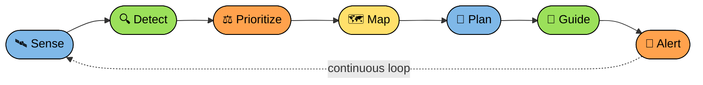
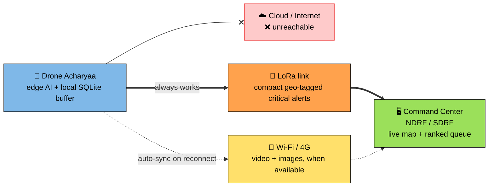
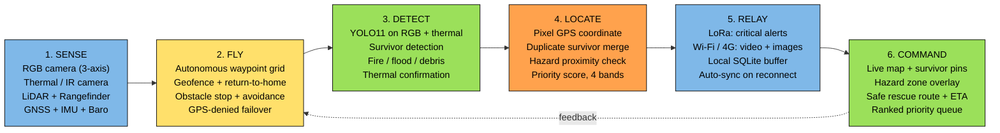
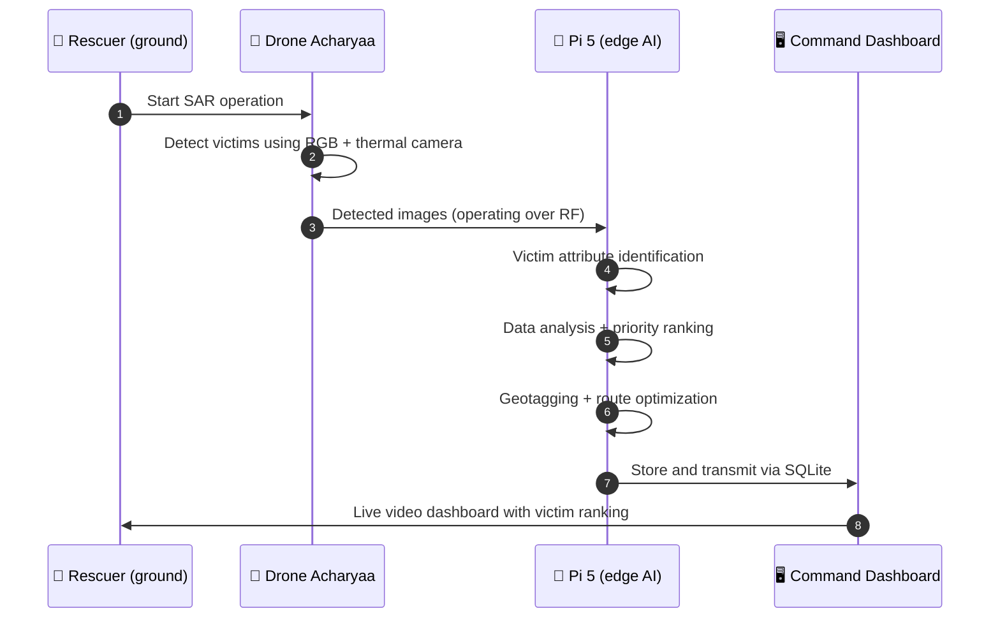
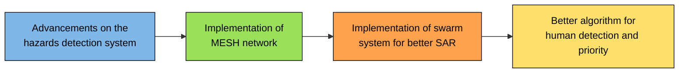

<!-- ============================================================
     DRONE ACHARYAA · Team MUYA CHAKHWI · SIH 2026 · PS 26177
     Single-file README: paste directly into your repo's README.md.
     No local images or asset folders are needed.
     ============================================================ -->

 

 

**🚁 Detect &nbsp;→&nbsp; 📍 Locate &nbsp;→&nbsp; ⚖️ Prioritize &nbsp;→&nbsp; 🧭 Guide &nbsp;·&nbsp; all without the internet**

## 📌 Table of Contents

- [Problem Statement](#-problem-statement)
- [Our Solution: Drone Acharyaa](#-our-solution-drone-acharyaa)
- [How Drone Acharyaa Operates](#-how-drone-acharyaa-operates)
- [What Makes It Different](#-what-makes-it-different)
- [System Architecture](#-system-architecture)
- [Flight Modes](#-flight-modes)
- [Methodologies](#-methodologies)
- [Technology Stack and Components](#-technology-stack-and-components)
- [Technical Workflow During Rescue](#-technical-workflow-during-rescue)
- [Feasibility and Viability](#-feasibility-and-viability)
- [Risks and Solutions](#-risks-and-solutions)
- [Impact and Benefits](#-impact-and-benefits)
- [Business Model](#-business-model)
- [Future Scope](#-future-scope)
- [References](#-references)
- [Meet the Team](#-meet-the-team)

## 🎯 Problem Statement

> **PS ID 26177:** A deployable AI-powered autonomous drone that aids search-and-rescue operations by detecting people and hazards, thereby improving responder safety and reducing victim discovery time.

| Field | Details |
|---|---|
| **Theme** | Robotics and Drones |
| **PS Category** | Hardware |
| **Team ID** | 181771 |
| **Team Name** | Muya Chakhwi |

### The problems we address

| # | Problem | Why it matters |
|---|---|---|
| 1 | **Delayed rescue** due to inaccessible or damaged terrain | Every minute lost reduces survival chances |
| 2 | **Connectivity loss** makes cloud-dependent solutions ineffective | Disaster zones often have no cellular or internet |
| 3 | **Risk to rescue teams** during manual assessments | Responders enter unassessed danger zones blindly |
| 4 | **GPS-denied zones** make conventional drone navigation unreliable | Standard drones drift or fail without GPS |
| 5 | **No prioritization among multiple survivors** | Critical cases may be treated as less urgent |

## 🚁 Our Solution: Drone Acharyaa

**Drone Acharyaa** is a hexacopter-based, edge-AI search-and-rescue platform. It detects survivors and hazards in real time using RGB and thermal vision, locates them, ranks them by urgency, and guides rescuers along safe routes. It does all of this **without depending on the internet**.

### Proposed solution impact

- ✅ Reduces dependency on large human search teams for the initial sweep
- ✅ Keeps data flowing to command centers even with zero cellular or internet infrastructure
- ✅ Removes the need for humans to enter unassessed danger zones blindly
- ✅ Reduces preventable deaths caused by resource misallocation
- ✅ Reduces dependence on imported commercial drone platforms

## 🔄 How Drone Acharyaa Operates

## ⭐ What Makes It Different

| Feature | Description |
|---|---|
| 🐝 **Swarm-based collaborative search** | Multiple drones cover the area together |
| 📴 **Offline AI model integration** | Reliable detection with no cloud dependency |
| 💰 **Cost effective** | Lower operating cost than current SAR drone technologies |
| 🌡️ **RGB + Thermal + GPS + IMU** | Multi-sensor fusion for higher reliability |
| 🛣️ **Dynamic safe corridors** | Constantly updated safe routes for rescuers |
| 🔋 **Energy-aware autonomy** | Optimizes search routes while keeping battery for a safe return |
| 🌊🔥 **Disaster-specific AI** | Built for floods, fire hazards, earthquakes, debris and more |

### 📴 Offline-first, in one picture

## 🧩 System Architecture

| Stage | Hardware / Software |
|---|---|
| **Sense** | Hexacopter with gimbaled payload |
| **Fly** | Pixhawk 6X v2 flight controller |
| **Detect** | Raspberry Pi 5 running YOLO11 |
| **Locate** | Geo-tagging and triage |
| **Relay** | Dual link, offline first |
| **Command** | Command center (NDRF / SDRF) |

## 🛫 Flight Modes

| 📍 GPS Available | 📴 Non-GPS / Offline | 🌲 Obstacle Detection |
|---|---|---|
| Waypoint survey grid | Optical flow + rangefinder | Forward rangefinder stop |
| Geofence + altitude cap | EKF source switching | Clearance-altitude survey |
| Coverage map, 30% overlap | Last-known-position hold | Geofence as primary guard |
| RTK-free ±2.5 m fix | Auto-RTH / safe land | Pilot override always live |

## 🔬 Methodologies

<table>
<tr>
<td width="50%" valign="top">

### 1️⃣ Edge AI Detection
- YOLO11 on RGB + thermal, on-board Raspberry Pi 5
- Detects survivors, fire, flood and debris offline
- Fine-tuned on aerial SAR data (e.g. HERIDAL, HIT-UAV)

</td>
<td width="50%" valign="top">

### 2️⃣ RGB + Thermal Fusion
- Thermal confirmation of every RGB detection
- Filters fire and hot debris, with a target of **<5% false positives**
- Confidence and evidence shown; a human verifies every alert

</td>
</tr>
<tr>
<td width="50%" valign="top">

### 3️⃣ Locate and Prioritize
- Pixel GPS coordinates and duplicate survivor merge
- Hazard proximity check on every detection
- Priority score in 4 bands, giving a ranked rescue queue

</td>
<td width="50%" valign="top">

### 4️⃣ Autonomous Navigation
- Waypoint grid, 30% overlap, geofence, energy-aware return-to-home
- GPS-denied: optical flow with EKF source switching
- Dynamic safe corridors and ETA for rescue teams

</td>
</tr>
</table>

**Comms:** LoRa alerts + SQLite auto-sync &nbsp;|&nbsp; **Validation:** simulation → field trials on recall, false positives and latency

## 🛠️ Technology Stack and Components

| Category | Items |
|---|---|
| **Airframe** | Hexacopter with 3-axis gimbaled payload |
| **Flight controller** | Pixhawk 6X v2 |
| **Onboard compute** | Raspberry Pi 5 |
| **Sensors** | RGB camera, thermal / IR camera, LiDAR + rangefinder, GNSS + IMU + barometer |
| **Communication** | LoRa (critical alerts), Wi-Fi / 4G (video + images) |
| **Software** | Python, FastAPI, MAVLink, Leaflet (live map dashboard), SQLite |
| **Ground control** | DRISHYA V1 GCS (Disaster Response Intelligence & Mission Control System): tactical map, mission planner, live camera, 3D LiDAR, Pi 5 status, survivor detection panel, mission log |

## 🌊 Technical Workflow During Rescue

## ✅ Feasibility and Viability

<table>
<tr>
<th width="33%">🔧 Technical</th>
<th width="33%">💰 Economical</th>
<th width="33%">🚚 Deployment and Logistics</th>
</tr>
<tr>
<td valign="top">

- **Embedded edge-AI architecture:** optimized, quantized computer-vision models for real-time victim detection on the edge
- **Multi-sensor fusion pipeline:** hardware-synchronized RGB + LWIR thermal feeds
- **GPS-denied visual odometry:** VIO and optical flow keep positioning, altitude hold and obstacle avoidance working

</td>
<td valign="top">

- **Lower cost per flight hour** than existing SAR drones
- **Rapid capital recovery:** low initial hardware and setup costs
- **Reduced human liability:** replaces high-risk pilot operations in hazardous environments

</td>
<td valign="top">

- **Offline and autonomous:** AI detection continues in network-disrupted zones
- **Low operator dependency:** one operator can supervise multiple drones
- **Rapid and scalable:** deploy and scale by disaster area and severity

</td>
</tr>
</table>

**Cost per hour (search-and-rescue missions):**

| | Existing SAR drones | Drone Acharyaa |
|---|---|---|
| **Operating cost / hour** | ₹5,000 – ₹15,000 | ₹4,000 – ₹8,000 |

## ⚠️ Risks and Solutions

| Risk | Solution | Strategy |
|---|---|---|
| 🔥 Fire, hot debris and heated surfaces may trigger **false survivor detections** | Fuse RGB confirmation, thermal signature analysis and a confidence threshold | Test with survivor, fire, debris and heated-surface scenarios; target **<5% false positives** |
| 📡 **LoRa bandwidth** is insufficient for live RGB / thermal video | Send compact geo-tagged alerts over LoRa; buffer footage onboard | Prioritize high-confidence alerts; sync footage over 5G / Wi-Fi when available |
| 🤖 AI may generate **incorrect or uncertain alerts**, causing hesitation | Show priority ranking, confidence score and RGB / thermal evidence for every detection | **Human verification** before final rescue prioritization, keeping the responder in control |

## 🌍 Impact and Benefits

<b>Click to expand or collapse the four impact areas</b>

 

| 💼 Economical | 💡 Innovational | 🇮🇳 National | 🤝 Social |
|---|---|---|---|
| Lower search cost | Edge RGB + thermal AI | Offline-first response | Faster survivor identification |
| Smarter responder deployment | Human-verified AI alerts | Scalable multi-drone search | Inaccessible-area search |
| Efficient flight usage | Closed-loop search | Real-time rescue intelligence | Reduced responder exposure |
| Reduced manpower burden | Communication-efficient intelligence | Rapid disaster assessment | Night-time search support |
| Scalable deployment | Modular AI architecture | Multi-agency coordination | Remote-area assistance |
| Reduced search redundancy | Adaptive search intelligence | Connectivity-resilient operations | Rapid disaster assistance |
| Better asset utilization | Multi-modal evidence fusion | Faster resource mobilization | Improved rescue accessibility |

### Key benefits

1. **Faster and more targeted rescue:** AI survivor detection and prioritization for targeted search and rescue.
2. **Safer rescue operations:** autonomous aerial reconnaissance assesses dangerous, unstable and inaccessible areas before humans enter.
3. **Rescue intelligence without internet dependency:** offline edge AI handles local detection, localization and decision support.
4. **Reliable, evidence-based alerts:** every alert carries AI confidence, GPS location and RGB / thermal evidence, with human verification before critical decisions.

## 💼 Business Model

 ➕ 

## 🔭 Future Scope

## 📚 References

<b>Click to view references</b>

 

- Sharing my experience from a country where DJI is banned
- Drones in Flood Rescue Search and Emergency operations
- Applications of drone in disaster management: A scoping review
- Drone Applications for Supporting Disaster Management (DOI: `10.4236/wjet.2015.33C047`)
- Sensors and tracking methods used in wireless sensor network based unmanned search and rescue system: a review
- Optimization cost of helicopter and UAV coordinated SAR time
- How Drones Cut Costs by 95% Per Hour in Disaster Management

<!-- TODO: add the actual URLs for each reference from your PDF links -->

## 👥 Meet the Team

  

<table>
<tr>
<td align="center" width="200">
 
<b>Sania Debbarma</b> 
👑 <i>Team Leader</i> 

</td>
<td align="center" width="200">
 
<b>Debashis Deb</b> 

</td>
<td align="center" width="200">
 
<b>Anup Sarkar</b> 

</td>
</tr>
<tr>
<td align="center" width="200">
 
<b>Gourab Das</b> 

</td>
<td align="center" width="200">
 
<b>Diya Das</b> 

</td>
<td align="center" width="200">
 
<b>Samadrita Chakraborty</b> 

</td>
</tr>
</table>

<!--
  OPTIONAL: to show real photos, replace an avatar's src with the person's GitHub photo:
  https://github.com/THEIR-GITHUB-USERNAME.png
  OPTIONAL: to add a team group photo, upload it to the repo and add under the typing animation:
  
-->

 

**Smart India Hackathon 2026 · Problem Statement 26177 · Team ID 181771**

*Drone Acharyaa: Intelligence That Guides, Eyes That Save* 🚁

